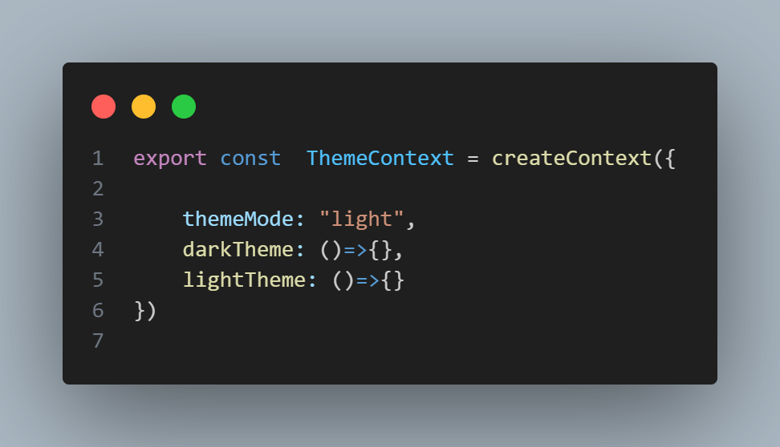
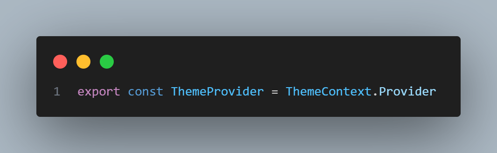
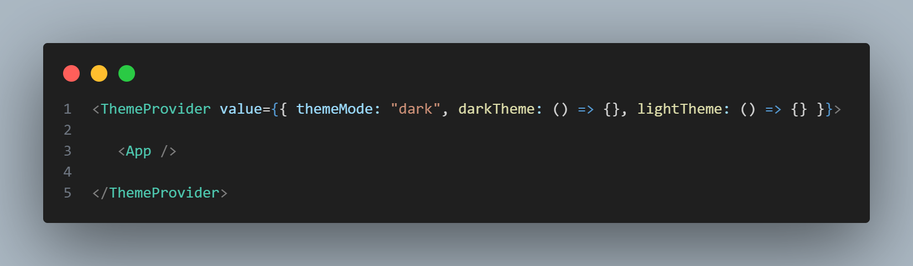
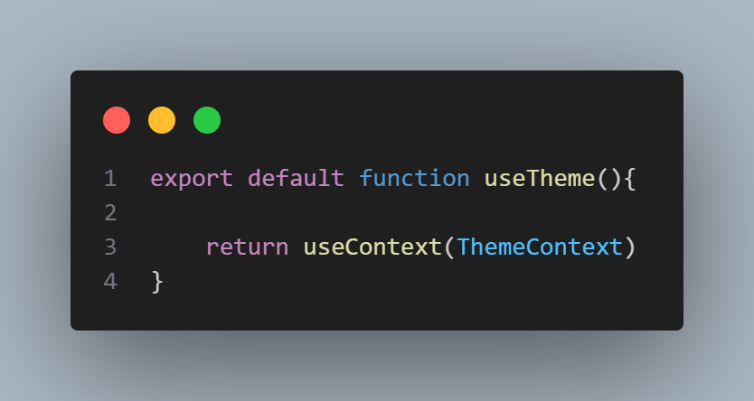
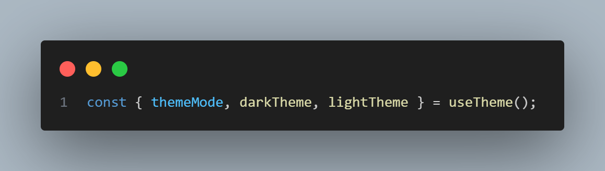

# Another way of Context API

## 1) What is React Context?
Problem: Passing props through many levels is annoying.

Solution: Context lets you share data (like theme, user, language) across the app without prop drilling.

Think of Context as a box that holds data. Any component can open the box and use the data—if it’s inside a Provider.

## 2) createContext — Making the Box

We set default values (used only if there’s no Provider above in the tree)

## 3) Provider — Distributing the Box

A Provider is the distributor of the box’s data. 
## Example

All components inside <App /> can now access themeMode, darkTheme, and lightTheme.

## 4) useContext (via useTheme) — Opening the Box

useContext(ThemeContext) reads data from the nearest ThemeProvider.

We wrapped it into a custom hook useTheme() so usage is clean:

## Mental Model (Super Simple)

createContext → Make a box to hold shared data.

Provider → Distribute that box to child components.

useContext / useTheme() → Open the box and use the data.

Your state and functions live above in a component and are passed to the Provider’s value.